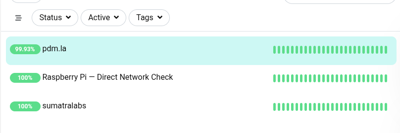

# You can't automate instinct and you can't program taste.

**Adam Stanger** is a producer, director, and editor with 30+ years of work aired globally. He also builds the infrastructure behind much of his own production work — self-hosted servers, local AI pipelines, and automation tooling, configured and maintained by hand, not outsourced.

---

## Now

**September 2026** — Building out a self-hosted monitoring and resilience stack (Uptime Kuma, Telegram alerts, cross-device recovery testing) and launching freelance video editing services.

---

## Featured Build: Self-Hosted Infrastructure

A hands-on project hosting public websites on self-managed hardware, monitored with Uptime Kuma and alerted through Telegram — including honest documentation of where the monitoring itself has real limits, like a monitor that can't report its own host losing power.

[View the full repo →](REPLACE-WITH-YOUR-REPO-LINK)

---

## Production

**Point Digital Media** — Managing Director, 2004–Present
Conceptualized, wrote, and produced series and documentary programming distributed internationally; produced an independent feature film shot in India for worldwide release.

**Lusus Labs** — Co-Founder, 2015–2018
Co-founded a startup that designed, built, and launched Peeqr, a live streaming app, on iTunes and Google Play.

**Lanikai Communications** — Executive Producer, 1998–2004
Creative direction and production management across Southeast Asia for government, multinational, and broadcast clients.

---

## Press

Featured in the [LA Examiner](REPLACE-WITH-ARTICLE-LINK) on how businesses are using AI to cut costs and restructure content production workflows.

---

## Writing

Longer-form thinking on AI, production, and the entertainment industry lives at [HollAIwood](REPLACE-WITH-LINK) — reporting from inside the build, not from the sidelines.

---

## Contact

[hello@pdm.la](mailto:hello@pdm.la)
